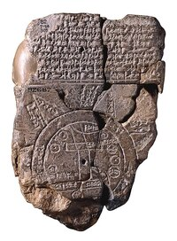
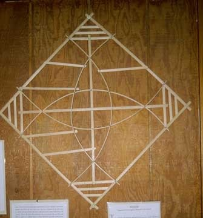

<!-- _class: title -->

# MapLibre GL JS と OpenStreetMap で始める ウェブカートグラフィ入門

## 第1回: 地図とウェブカートグラフィの基礎

立命館大学 2025年度 秋セメスター 火曜5限
授業時間: 85分

---

## 本日のアジェンダ

1. **自己紹介・授業概要** (10分)
2. **地図とは何か？** (15分)
3. **ウェブで用いられる地図アプリのオーバービュー** (25分)
4. **授業の全体像と使用ツールの紹介** (20分)
5. **実習環境の確認** (10分)
6. **課題説明** (5分)

---

## 自己紹介

- ソフトウェア開発者
  - フリーランス・企業勤務。開発歴 12年
    - ウェブ開発
    - 地図配信サービス開発
  - 立命館大学
    - 授業担当講師
    - アートリサーチセンター 補助研究員

---

## 授業概要

### 授業名
MapLibre GL JS と OpenStreetMap で始めるウェブカートグラフィ入門

- **MapLibre GL JS** ブラウザで地図を表示するためのライブラリ
- **OpenStreetMap** ウェブで利用できる地図、あるいは地図コミュニティ
- **カートグラフィ** 地図作成のこと。(地図) -graphy (記述したもの)

---

## 授業概要

### 授業全体を通した目標
- ウェブ地図の技術を理解する
- 地図アプリケーションの仕組みを理解する
- 地図アプリケーションを活用をできる
- **オープンデータ**を活用できる
- **オープンソース**ソフトウェアを活用できる

---

## 地図・ウェブ地図

使ったことがあるを地図教えてください。

<vote-form vote-key="favorite-maps" freetext="on" choices="Google Maps,マップ（iOS）,Yahoo!マップ,地理院地図,ゼンリン地図,地形図(国土地理院、紙)" />

---

## 紙の地図・デジタルの地図

- 紙の地図とデジタルの地図（ウェブやアプリ）の違いは？
- 紙、ウェブ、アプリ以外にどんな媒体があるだろうか？

<vote-form vote-key="map-media" freetext="on" view="freeflow" />

---

## 面白い地図の媒体

|||
| ---- | ---- |
|バビロニアの世界地図。<small>紀元前600年</small>|ミクロネシアのスティックチャート<small>（海図）</small>|

---

## ウェブ地図の特徴

デジタルの地図、特にウェブの地図は、紙などの媒体とどのように違うのだろう？

<vote-form vote-key="map-media" freetext="on" view="freeflow" />

---

## ウェブ地図の特徴（私の考え）

- **オンデマンド** （必要な時に、必要なものを入手）
- **インタラクティブ**（双方向性に情報をやり取り。ユーザーの操作に応じた多様なインターフェース）

---

## 色々な地図アプリ

### 主要な地図サービス

#### [Google Maps](https://www.google.com/maps)
- **特徴**: アプリ 10億ダウンロード<small>[*1]</small>、豊富な POI (Point of Interest)
- **技術**: 独自のタイル配信システム
- **ライセンス**: 基本的に有料

<!-- _footer: '[*1 <a href="https://www.nikkei.com/article/DGXZRSP642755_V21C22A0000000/">App Annie Japan、「Googleマップアプリ10億ダウンロード突破」について発表</a> 日本産経新聞' -->

---

#### [OpenStreetMap](https://www.openstreetmap.org/)
- **特徴**: オープンソース、コミュニティ主導
- **技術**: オープンデータ、自由に利用可能
- **ライセンス**: ODbL（Open Database License）

---

#### その他の地図サービス
- **Mapbox**: ベクトルタイル
- **Apple Maps**: iOS標準
- **Bing Maps**: Microsoft提供
- **HERE Maps**: 自動車業界で強い
- **国土地理院地図**: 日本の公的地図

---

## ウェブ地図の特徴をより詳しく(1/2)

### オンデマンド
- **利用コスト**: 使った分だけ払う
- **通信量**: 必要な分だけ、リクエストして取り寄せる

### インタラクティブ
- **ズーム・パン**: スムーズな操作
- **レイヤー切り替え**: 用途に応じた表示
- **ポップアップ**: 詳細情報の表示
- **検索機能**: 住所・施設名での検索
- **リアルタイム**: GPS連携、渋滞・事故情報、天気・災害情報

---

## ウェブ地図の特徴をより詳しく(2/2)

### カスタマイズ性
- **スタイリング**: 色・フォント・アイコンの変更
- **データ統合**: 独自データの重ね合わせ
- **機能拡張**: プログラミングによる機能追加

### 3D・AR対応
- **3D建物表示**: 立体的な都市景観
- **地形表示**: 標高データの可視化
- **AR連携**: 現実世界との重ね合わせ

---

## 使用ツールの紹介

### 1. MapLibre GL JS
- **概要**: オープンソースの地図ライブラリ
- **特徴**: 
  - Mapboxが開発した Mapbox GL JS からフォークされたオープンソースプロジェクト
  - 無料で利用可能
  - 高性能なベクタータイル表示
  - 豊富なカスタマイズオプション

---

### 2. OpenStreetMap (OSM)
- **概要**: みんなで作る自由な地図。そのコミュニティ。
- **特徴**: 
  - 誰でも編集可能
  - 商用利用可能
  - 豊富な属性情報
  - 世界中のコミュニティが維持

---

## 実習環境の確認

### 必要なソフトウェア

- **ブラウザ**: Google Chrome
- **エディタ**: GitHub Codespace (オンラインエディタ)

---

## GitHub について

- GitHub のアカウント登録
- GitHub について
- GitHub Codespace について

---

### 環境セットアップ

- GitHub であらかじめ用意した以下のリポジトリを codespace で開き、実行
- カスタマイズして、表示がどう変わるか確認

リポジトリ: https://github.com/kamataryo/rits-2025-fall-cartography__01-webmap-sample

Codespace で開く

---

### カスタマイズしてみる

- ズームを変える
- 緯度経度を変える
- 地図の種類を変える
- ..

---

## 課題: 興味のある地図を1つ選び、特徴を調査する

### 課題内容
以下のいずれかの地図サービス・アプリケーションを選び、その特徴を調査してレポートを作成してください。

**対象地図サービス例: **
- Google Maps / Google Earth
- OpenStreetMap
- Mapbox
- 国土地理院地図
- Yahoo!地図
- その他（普段から使っているアプリに地図が組み込まれているなら、それを調査しても OK）

---

### どんな点に着目するか

1. **基本情報**
   誰がサービスを提供しているのか？、いつから使われているのか等

3. **機能・特徴**
   - どのようなユーザーを対象としているのか
   - 主要な機能、他サービスとの差別化ポイント、得意分野・用途
   - どんなビジネスモデルなのか
   - etc.

4. **個人的な評価**
   - 良いと思う点、改善してほしい点、おもしろい点
   - 「こんなふうにいつも使っている」

---

### 提出要項
- **形式など**: 400字程度。図や写真、スクリーンショット等を添付しても構いません。PDF / Word等。その他のフォーマットは応相談。
- **提出期限**: 次回授業開始時
- **提出方法**: Manaba+R 経由
- **評価基準**: 
  - 調査内容・正確性
  - 分析・考察の質
  - 文章構成や表現の適切さ

---

## 質疑応答

### 本日の内容について
- 授業内容に関する質問
- 授業の進め方について
- 課題に関する質問

### 連絡先
- Manaba+R
- **メール**: [kamata.y.ryo@gmail.com]

---

<!-- _class: title -->

# ありがとうございました

## 次回もよろしくお願いします

**第2回: 地図データの基礎**
