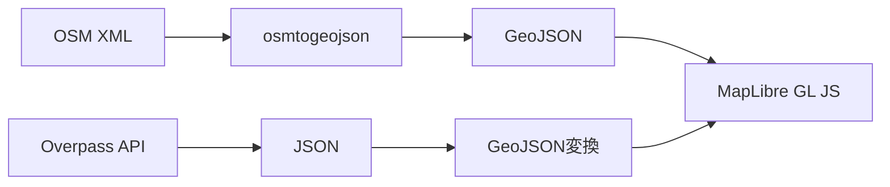

<script src="https://g69ye6vo2a.execute-api.ap-northeast-1.amazonaws.com/v1/client/vote-client.min.js"></script>
<script>
  document.addEventListener("DOMContentLoaded", () => {
    document.querySelectorAll("section").forEach(section => {
      const reaction = document.createElement("reaction-component");
      reaction.setAttribute("emojis", "👍,👎,🤔,💡");
      section.appendChild(reaction);
    });
  });
</script>
<style>
/* ページ番号は右上。リアクションコンポーネントをおきたいので */
section.title::after { top: 21px; }
</style>

<!-- _class: title -->

# MapLibre GL JS と OpenStreetMap で始める<br />ウェブカートグラフィ入門

## 第2回：地図データの基礎

立命館大学 2025年度 秋セメスター 火曜5限
授業時間：85分

---

## 本日のアジェンダ

1. **前回の振り返り・課題確認** (10分)
2. **空間データとは何か** (20分)
3. **ジオメトリの基礎** (25分)
4. **地理座標系と投影法** (20分)
5. **OpenStreetMapデータの構造** (10分)

---

## 前回の振り返り

### 第1回の主要ポイント
- ウェブカートグラフィの概要
- 地図サービスの技術的分類（ラスター vs ベクター）
- MapLibre GL JS と OpenStreetMap の紹介
- 授業の全体像

### 課題の確認
興味のある地図サービスの特徴調査
- 技術的特徴の理解
- 機能・ユーザビリティの評価
- ビジネスモデルの分析

---

## 空間データとは何か？

### 空間データの定義
> 地球上の位置や形状、属性を持つデータ

### 空間データの特徴
- **位置情報**：緯度・経度による座標
- **形状情報**：点・線・面などのジオメトリ
- **属性情報**：名前・種類・特性などの付加情報
- **時間情報**：データの取得・更新時刻

---

### 空間データの例

#### 自然地物
- **山**：標高点（ポイント）、等高線（ライン）
- **河川**：流路（ライン）、湖沼（ポリゴン）
- **森林**：森林域（ポリゴン）

#### 人工地物
- **道路**：道路網（ライン）
- **建物**：建物外形（ポリゴン）
- **施設**：店舗・学校（ポイント）

---

## ジオメトリの基礎

### 基本的なジオメトリタイプ

#### 1. ポイント（Point）
- **定義**：0次元の幾何学的オブジェクト
- **表現**：単一の座標点
- **用途**：店舗、駅、観光地、事故地点など

```json
{
  "type": "Point",
  "coordinates": [135.5, 34.7]
}
```

---

#### 2. ライン（LineString）
- **定義**：1次元の幾何学的オブジェクト
- **表現**：複数の座標点を結んだ線
- **用途**：道路、河川、境界線、ルートなど

```json
{
  "type": "LineString",
  "coordinates": [
    [135.5, 34.7],
    [135.6, 34.8],
    [135.7, 34.9]
  ]
}
```

---

#### 3. ポリゴン（Polygon）
- **定義**：2次元の幾何学的オブジェクト
- **表現**：閉じた線で囲まれた領域
- **用途**：建物、行政区域、土地利用、湖沼など

```json
{
  "type": "Polygon",
  "coordinates": [[
    [135.5, 34.7],
    [135.6, 34.7],
    [135.6, 34.8],
    [135.5, 34.8],
    [135.5, 34.7]
  ]]
}
```

---

### 複合ジオメトリタイプ

#### MultiPoint / MultiLineString / MultiPolygon
- 同じタイプの複数のジオメトリをまとめたもの
- 例：離島を含む都道府県（MultiPolygon）

#### GeometryCollection
- 異なるタイプのジオメトリをまとめたもの
- 例：駅（Point）と駅前広場（Polygon）

---

## 地理座標系と投影法

### 地理座標系（Geographic Coordinate System）

#### 緯度・経度システム
- **緯度（Latitude）**：赤道を基準とした南北の角度（-90° ～ +90°）
- **経度（Longitude）**：本初子午線を基準とした東西の角度（-180° ～ +180°）
- **測地系**：地球の形状を近似する楕円体

---

### 主要な測地系

#### WGS84（World Geodetic System 1984）
- **特徴**：GPS で使用される世界標準
- **用途**：Web地図、GPS機器、国際的なデータ交換
- **EPSG コード**：EPSG:4326

#### JGD2011（日本測地系2011）
- **特徴**：日本の公式測地系
- **用途**：国土地理院の地図、公的な測量
- **EPSG コード**：EPSG:6668

---

### 投影法（Map Projection）

#### なぜ投影が必要か？
- 地球は球体（楕円体）
- 地図は平面
- 球面を平面に変換する際に必ず歪みが生じる

#### 投影法の分類
- **正角図法**：角度を正しく保つ（メルカトル図法）
- **正積図法**：面積を正しく保つ（モルワイデ図法）
- **正距図法**：特定方向の距離を正しく保つ

---

### Web地図で使用される投影法

#### Web メルカトル図法（EPSG:3857）
- **正式名称**：WGS 84 / Pseudo-Mercator
- **特徴**：
  - 角度を保持（正角図法）
  - 高緯度地域で面積が大きく歪む
  - タイル分割に適している
- **用途**：Google Maps、OpenStreetMap、Mapbox など

---

### 座標系の変換

#### 実際の例：大阪駅の座標

| 座標系 | 緯度/Y | 経度/X |
|--------|--------|--------|
| WGS84 (EPSG:4326) | 34.7024° | 135.4959° |
| Web メルカトル (EPSG:3857) | 4,086,777 m | 15,084,814 m |

```javascript
// MapLibre GL JS では自動的に変換される
map.setCenter([135.4959, 34.7024]); // WGS84で指定
```

---

## OpenStreetMapデータの構造

### OSMの基本要素

#### 1. ノード（Node）
- **定義**：単一の地理的ポイント
- **属性**：ID、緯度、経度、タグ
- **用途**：独立したPOI、ウェイの構成要素

#### 2. ウェイ（Way）
- **定義**：ノードの順序付きリスト
- **用途**：道路、建物の外形、境界線
- **種類**：開いたウェイ（道路）、閉じたウェイ（建物）

---

#### 3. リレーション（Relation）
- **定義**：ノード、ウェイ、他のリレーションの集合
- **用途**：複雑な地理的関係の表現
- **例**：バス路線、行政境界、マルチポリゴン

### タグシステム
- **Key-Value ペア**：`highway=primary`, `name=大阪駅`
- **自由度の高い分類**：コミュニティが定義
- **階層的な分類**：`amenity=restaurant`, `cuisine=japanese`

---

### OSMデータの例

#### 大阪駅のノード
```xml
<node id="123456" lat="34.7024" lon="135.4959">
  <tag k="name" v="大阪駅"/>
  <tag k="railway" v="station"/>
  <tag k="operator" v="JR西日本"/>
</node>
```

#### 道路のウェイ
```xml
<way id="789012">
  <nd ref="123456"/>
  <nd ref="123457"/>
  <nd ref="123458"/>
  <tag k="highway" v="primary"/>
  <tag k="name" v="御堂筋"/>
</way>
```

---

## データ形式の比較

### OSM XML vs GeoJSON

| 特徴 | OSM XML | GeoJSON |
|------|---------|---------|
| 構造 | ノード・ウェイ・リレーション | Feature・Geometry・Properties |
| 用途 | OSM編集・データ交換 | Web地図・API |
| ファイルサイズ | 大きい | 比較的小さい |
| 可読性 | 低い | 高い |
| Web対応 | 要変換 | ネイティブ対応 |

---

### データ変換の流れ



---

## 実習：OSMデータの確認

### OpenStreetMap.org での確認
1. https://www.openstreetmap.org/ にアクセス
2. 興味のある場所を検索
3. 地物をクリックして詳細情報を確認
4. タグ情報の確認

### 確認ポイント
- どのようなタグが使われているか
- ジオメトリタイプは何か
- 属性情報の豊富さ

---

## 地図データの品質

### データ品質の要素

#### 1. 完全性（Completeness）
- 必要なデータがすべて含まれているか
- 欠損データの有無

#### 2. 正確性（Accuracy）
- 位置の正確さ
- 属性情報の正確さ

#### 3. 一貫性（Consistency）
- タグ付けルールの統一
- データ形式の統一

---

#### 4. 最新性（Currency）
- データの更新頻度
- 現実世界との同期

#### 5. 論理的一貫性（Logical Consistency）
- トポロジーの正確性
- 関係性の整合性

### OSMの品質管理
- **コミュニティによる相互チェック**
- **自動化ツールによる検証**
- **品質保証プロジェクト**

---

## 今後の学習に向けて

### 次回以降で学ぶこと
- **第3-4回**：OpenStreetMapのカルチャーと利用
- **第5回**：GeoJSONの基礎
- **第6回**：ウェブ地図の構成要素

### 重要なポイント
- 空間データの基本概念の理解
- 座標系・投影法の重要性
- OSMデータ構造の特徴

---

<div class="assignment">

## 課題：OpenStreetMapから好きな場所を探し、そのデータ構造を調査する

### 課題内容
OpenStreetMap（https://www.openstreetmap.org/）を使用して、興味のある場所を1つ選び、そのデータ構造を詳しく調査してレポートを作成してください。

### 調査対象の例
- 自分の出身地・居住地
- 大学・学校
- 好きな観光地
- 興味のある施設（駅、商業施設、公園など）

</div>

---

<div class="assignment">

### 調査項目

#### 1. 基本情報
- 場所の名前と概要
- 選んだ理由

#### 2. ジオメトリ分析
- 主要な地物のジオメトリタイプ（ポイント・ライン・ポリゴン）
- 複合的な地物の構造

#### 3. タグ分析
- 使用されている主要なタグ（key-value ペア）
- タグの種類と意味
- 属性情報の豊富さ

</div>

---

<div class="assignment">

#### 4. データ品質評価
- 情報の完全性（必要な情報が揃っているか）
- 情報の正確性（実際の状況と一致しているか）
- 最新性（情報が最新か）

#### 5. 改善提案
- 不足している情報
- 改善できる点
- 追加したい情報

### 提出要項
- **形式**：A4用紙2-3枚程度のレポート（PDF形式）
- **提出期限**：次回授業開始時
- **提出方法**：学習管理システム経由

</div>

---

<div class="assignment">

### 評価基準
- **調査の深さ・正確性**（40%）
  - データ構造の理解度
  - タグ分析の詳細さ
- **分析・考察の質**（40%）
  - データ品質の評価
  - 改善提案の妥当性
- **文章構成・表現力**（20%）
  - レポートの構成
  - 図表の効果的な使用

### 参考資料
- OpenStreetMap Wiki: https://wiki.openstreetmap.org/
- OSM タグ情報: https://taginfo.openstreetmap.org/

</div>

---

## 次回予告

### 第3-4回：OpenStreetMapのカルチャーと利用
- OpenStreetMapコミュニティとデータの作成プロセス
- Overpass Turbo / Overpass API の紹介
- データを取得して簡単に利用する方法
- 実際のデータ取得・分析の実習

### 準備事項
- OpenStreetMapアカウントの作成（推奨）
- 今回の課題で調査した場所の詳細な把握

---

## 質疑応答

### 本日の内容について
- 空間データ・ジオメトリに関する質問
- 座標系・投影法について
- OpenStreetMapデータ構造について
- 課題に関する質問

---

<!-- _class: title -->

# ありがとうございました

## 次回もよろしくお願いします

**第3-4回：OpenStreetMapのカルチャーと利用**
[日時・教室]

課題の提出をお忘れなく！
