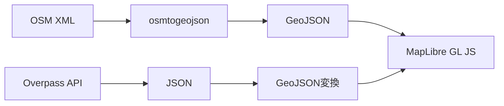

<script src="https://g69ye6vo2a.execute-api.ap-northeast-1.amazonaws.com/v1/client/vote-client.min.js"></script>
<script>
  document.addEventListener("DOMContentLoaded", () => {
    document.querySelectorAll("section").forEach(section => {
      const reaction = document.createElement("reaction-component");
      reaction.setAttribute("emojis", "👍,👎,🤔,💡");
      section.appendChild(reaction);
    });
  });
</script>
<style>
/* ページ番号は右上。リアクションコンポーネントをおきたいので */
section.title::after { top: 21px; }
</style>

<!-- _class: title -->

# MapLibre GL JS と OpenStreetMap で始める<br />ウェブカートグラフィ入門

## 第4-5回：OpenStreetMapのカルチャーと利用

立命館大学 2025年度 秋セメスター 火曜5限
授業時間：190分（2回分）

---

## TODO: アイデア

### 前半戦

- キャッチ・導入: Google Maps を印刷して使って良いのか？
 => ならば OSM
 歴史や哲学には深入りしたくない。ただし、コミュニティの理念は尊重したい
 アカウント作成と地図の編集（アップデート）は体験してほしい

### 後半戦

- データを見てみることにフォーカス


---

## 本日のアジェンダ

### 第4回（前半95分）
1. **前回の振り返り・課題確認** (12分)
2. **OpenStreetMapの歴史と哲学** (28分)
3. **OSMコミュニティとデータ作成プロセス** (35分)
4. **休憩** (10分)
5. **OSM編集の基礎** (10分)

### 第5回（後半95分）
1. **Overpass Turbo の紹介と実習** (45分)
2. **Overpass API の活用** (28分)
3. **データ取得・分析の実践** (17分)
4. **課題説明** (5分)

---

## 前回の振り返り

### 第3回の主要ポイント
- GeoJSON フォーマットの理解
- GeoJSON の構造と記法（Geometry, Feature, FeatureCollection）
- 座標系と座標の順序（経度, 緯度）
- 簡単な GeoJSON ファイルの作成

## OpenStreetMapデータの構造

### OSMの基本要素

#### 1. ノード（Node）
- **定義**: 単一の地理的ポイント
- **属性**: ID、緯度、経度、タグ
- **用途**: 独立したPOI、ウェイの構成要素

#### 2. ウェイ（Way）
- **定義**: ノードの順序付きリスト
- **用途**: 道路、建物の外形、境界線
- **種類**: 開いたウェイ（道路）、閉じたウェイ（建物）

---

#### 3. リレーション（Relation）
- **定義**: ノード、ウェイ、他のリレーションの集合
- **用途**: 複雑な地理的関係の表現
- **例**: バス路線、行政境界、マルチポリゴン

### タグシステム
- **Key-Value ペア**: `highway=primary`, `name=大阪駅`
- **自由度の高い分類**: コミュニティが定義
- **階層的な分類**: `amenity=restaurant`, `cuisine=japanese`

---

### OSMデータの例

#### 大阪駅のノード
```xml
<node id="123456" lat="34.7024" lon="135.4959">
  <tag k="name" v="大阪駅"/>
  <tag k="railway" v="station"/>
  <tag k="operator" v="JR西日本"/>
</node>
```

#### 道路のウェイ
```xml
<way id="789012">
  <nd ref="123456"/>
  <nd ref="123457"/>
  <nd ref="123458"/>
  <tag k="highway" v="primary"/>
  <tag k="name" v="御堂筋"/>
</way>
```

---

## データ形式の比較

### OSM XML vs GeoJSON

| 特徴 | OSM XML | GeoJSON |
|------|---------|---------|
| 構造 | ノード・ウェイ・リレーション | Feature・Geometry・Properties |
| 用途 | OSM編集・データ交換 | Web地図・API |
| ファイルサイズ | 大きい | 比較的小さい |
| 可読性 | 低い | 高い |
| Web対応 | 要変換 | ネイティブ対応 |

---

### データ変換の流れ



---

## 実習: OSMデータの確認

### OpenStreetMap.org での確認
1. https://www.openstreetmap.org/ にアクセス
2. 興味のある場所を検索
3. 地物をクリックして詳細情報を確認
4. タグ情報の確認

### 確認ポイント
- どのようなタグが使われているか
- ジオメトリタイプは何か
- 属性情報の豊富さ

---

## 地図データの品質

### データ品質の要素

#### 1. 完全性（Completeness）
- 必要なデータがすべて含まれているか
- 欠損データの有無

#### 2. 正確性（Accuracy）
- 位置の正確さ
- 属性情報の正確さ

#### 3. 一貫性（Consistency）
- タグ付けルールの統一
- データ形式の統一

---

#### 4. 最新性（Currency）
- データの更新頻度
- 現実世界との同期

#### 5. 論理的一貫性（Logical Consistency）
- トポロジーの正確性
- 関係性の整合性

### OSMの品質管理
- **コミュニティによる相互チェック**
- **自動化ツールによる検証**
- **品質保証プロジェクト**


---

# 第3回：OpenStreetMapの歴史と哲学

---

## 前回の振り返り

### 第2回の主要ポイント
- 空間データの基本概念（ポイント・ライン・ポリゴン）
- 地理座標系と投影法（WGS84、Web メルカトル）
- OpenStreetMapデータの構造（ノード・ウェイ・リレーション）
- タグシステムによる属性情報

### 課題の確認
OpenStreetMapから好きな場所を選んでデータ構造を調査
- ジオメトリ分析
- タグ分析
- データ品質評価

---

## OpenStreetMapの歴史

### 誕生の背景（2004年）

#### 創設者：スティーブ・コースト（Steve Coast）
- イギリスの大学生
- 既存の地図データの制約に不満
- 「地図は誰のものでもない。みんなのものである。」

#### 当時の地図データの問題
- **高額なライセンス料**：商用利用には多額の費用
- **利用制限**：再配布・改変の制限
- **データの不完全性**：特定地域の情報不足
- **更新の遅れ**：現実との乖離

---

### OSMの発展

#### 初期（2004-2006年）
- イギリスを中心とした小規模コミュニティ
- GPS機器を使った手動データ収集
- 基本的な道路網の構築

#### 成長期（2007-2010年）
- 世界各地への拡大
- Yahoo! 航空写真の利用許可
- 編集ツールの改善

#### 成熟期（2011年以降）
- 企業の参加・支援
- 人道支援活動での活用
- 機械学習による自動化

---

### 重要な転換点

#### 2012年：ライセンス変更
- **旧ライセンス**：CC-BY-SA（クリエイティブ・コモンズ）
- **新ライセンス**：ODbL（Open Database License）
- **目的**：データベースとしての利用を明確化

#### 2017年：Facebook の参加
- AI を使った道路検出
- 大規模なデータ改善プロジェクト

#### 2020年：Apple の参加
- Apple Maps のデータ改善
- 企業による大規模貢献の例

---

## OpenStreetMapの哲学

### 基本理念

#### 1. オープンデータ
> 「地図データは人類共通の財産である」

- 誰でも自由に利用可能
- 商用利用も無料
- 改変・再配布も自由

#### 2. 集合知
> 「多くの目があれば、すべてのバグは浅い」

- コミュニティによる相互チェック
- 継続的な改善
- 地域の専門知識の活用

---

#### 3. 地域主権
> 「その場所を最もよく知るのは、そこに住む人々」

- 現地の人による編集を重視
- 地域固有の情報の反映
- 文化的多様性の尊重

#### 4. 透明性
> 「すべての変更は記録され、公開される」

- 編集履歴の完全な記録
- 変更理由の明示
- 責任の所在の明確化

---

### OSMの価値観

#### Do What's Right（正しいことをする）
- 現実世界の正確な反映
- 中立的な視点
- 事実に基づく編集

#### Be Excellent to Each Other（互いを尊重する）
- 建設的な議論
- 新規参加者への支援
- 多様性の受容

#### Assume Good Faith（善意を前提とする）
- 悪意のない間違いとして扱う
- 教育的なアプローチ
- 対話による解決

---

## OSMコミュニティとデータ作成プロセス

### グローバルコミュニティ

#### 統計（2024年現在）
- **登録ユーザー数**：約1,000万人
- **アクティブユーザー**：約100万人/月
- **総編集回数**：約10億回
- **ノード数**：約90億個

#### 地域別の特徴
- **ヨーロッパ**：高密度・高品質
- **北米**：企業貢献が活発
- **アジア**：急速な成長
- **アフリカ**：人道支援での活用

---

### 日本のOSMコミュニティ

#### 主要な組織
- **OpenStreetMap Foundation Japan**：日本支部
- **State of the Map Japan**：年次カンファレンス
- **地域コミュニティ**：各都道府県レベル

#### 特徴的な活動
- **マッピングパーティ**：集団での地図作成イベント
- **災害対応**：東日本大震災、熊本地震での活用
- **交通データ**：詳細な公共交通情報

---

### データ作成プロセス

#### 1. 現地調査（Survey）
- **GPS機器**：位置情報の記録
- **写真撮影**：詳細情報の記録
- **フィールドペーパー**：紙地図への記録
- **モバイルアプリ**：StreetComplete、Vespucci など

#### 2. 編集（Editing）
- **iD エディタ**：ブラウザベースの初心者向け
- **JOSM**：高機能なデスクトップアプリ
- **Potlatch**：Flash ベースの軽量エディタ

---

#### 3. 品質管理（Quality Assurance）
- **自動検証**：OSM Inspector、Osmose
- **人的チェック**：経験豊富なユーザーによるレビュー
- **コミュニティフィードバック**：議論・修正

#### 4. データ配信（Distribution）
- **Planet.osm**：全世界データのダンプ
- **地域抽出**：Geofabrik、BBBike
- **API アクセス**：リアルタイムデータ

---

### 編集の種類

#### 個人編集
- **日常的な更新**：住所、店舗情報
- **趣味の反映**：ハイキングコース、サイクリングルート
- **専門知識の活用**：建築、交通、自然

#### 組織的編集
- **企業による貢献**：Apple、Facebook、Microsoft
- **政府機関**：国土地理院、自治体
- **NGO・NPO**：人道支援団体

---

## OSM編集の基礎

### iD エディタの使用

#### アクセス方法
1. https://www.openstreetmap.org/ にアクセス
2. アカウント作成・ログイン
3. 「編集」ボタンをクリック
4. iD エディタが起動

#### 基本操作
- **ポイントの追加**：地図上をクリック
- **ラインの描画**：連続クリックで線を描画
- **エリアの作成**：閉じた線でポリゴンを作成
- **タグの設定**：属性情報の追加

---

### 編集のベストプラクティス

#### 編集前の確認
- **既存データの確認**：重複の回避
- **航空写真の確認**：正確な位置の把握
- **現地情報の確認**：最新状況の反映

#### 編集時の注意点
- **適切なタグの使用**：標準的なタグの選択
- **詳細な変更セットコメント**：編集理由の明記
- **段階的な編集**：大きな変更は分割して実施

---

### タグ付けのルール

#### 主要なタグ体系

##### 道路（highway）
```
highway=motorway      # 高速道路
highway=primary       # 国道
highway=secondary     # 県道
highway=residential   # 住宅街の道路
highway=footway       # 歩道
```

##### 建物（building）
```
building=yes          # 一般的な建物
building=house        # 住宅
building=commercial   # 商業建物
building=school       # 学校
```

---

##### 店舗・施設（amenity）
```
amenity=restaurant    # レストラン
amenity=school        # 学校
amenity=hospital      # 病院
amenity=bank          # 銀行
amenity=parking       # 駐車場
```

##### 自然地物（natural）
```
natural=water         # 水域
natural=forest        # 森林
natural=beach         # 海岸
natural=mountain_peak # 山頂
```

---

# 第4回：Overpass Turbo と API の活用

---

## Overpass Turbo の紹介

### Overpass Turbo とは？

#### 概要
- **Webベースの OSM データ検索ツール**
- **リアルタイムデータアクセス**
- **視覚的な結果表示**
- **クエリの共有機能**

#### アクセス方法
- URL: https://overpass-turbo.eu/
- ブラウザで直接利用可能
- アカウント不要

---

### Overpass API の仕組み

#### Overpass API とは？
- OSM データベースへの読み取り専用 API
- 複雑な地理空間クエリに対応
- 高速な検索・フィルタリング機能

#### データの更新頻度
- **通常**：数分〜数時間の遅延
- **リアルタイム性**：編集直後は反映されない場合がある
- **用途**：分析・可視化・アプリケーション開発

---

### Overpass QL（クエリ言語）

#### 基本構文

##### 1. エリアの指定
```overpass
[out:json][timeout:25];
(
  area["name"="大阪市"];
)->.searchArea;
```

##### 2. 要素の検索
```overpass
(
  node["amenity"="restaurant"](area.searchArea);
  way["amenity"="restaurant"](area.searchArea);
  relation["amenity"="restaurant"](area.searchArea);
);
```

---

##### 3. 結果の出力
```overpass
out geom;
```

#### 完全なクエリ例
```overpass
[out:json][timeout:25];
(
  area["name"="大阪市"];
)->.searchArea;
(
  node["amenity"="restaurant"](area.searchArea);
  way["amenity"="restaurant"](area.searchArea);
  relation["amenity"="restaurant"](area.searchArea);
);
out geom;
```

---

## Overpass Turbo 実習

### 実習1：基本的な検索

#### 目標
特定の地域のレストランを検索する

#### 手順
1. Overpass Turbo にアクセス
2. 地図を目的の地域に移動
3. 「ウィザード」を使用
4. "amenity=restaurant" と入力
5. 「クエリを作成して実行」をクリック

---

### 実習2：複合条件での検索

#### 目標
日本料理レストランのみを検索する

#### クエリ例
```overpass
[out:json][timeout:25];
(
  node["amenity"="restaurant"]["cuisine"="japanese"]({{bbox}});
  way["amenity"="restaurant"]["cuisine"="japanese"]({{bbox}});
  relation["amenity"="restaurant"]["cuisine"="japanese"]({{bbox}});
);
out geom;
```

---

### 実習3：距離による検索

#### 目標
特定の地点から半径1km以内の駅を検索

#### クエリ例
```overpass
[out:json][timeout:25];
(
  node["railway"="station"](around:1000,34.7024,135.4959);
  way["railway"="station"](around:1000,34.7024,135.4959);
  relation["railway"="station"](around:1000,34.7024,135.4959);
);
out geom;
```

---

### 実習4：時間範囲での検索

#### 目標
最近1週間に編集された要素を検索

#### クエリ例
```overpass
[out:json][timeout:25][date:"2024-01-01T00:00:00Z"];
(
  node(changed:"2024-01-01T00:00:00Z","2024-01-08T00:00:00Z")({{bbox}});
  way(changed:"2024-01-01T00:00:00Z","2024-01-08T00:00:00Z")({{bbox}});
  relation(changed:"2024-01-01T00:00:00Z","2024-01-08T00:00:00Z")({{bbox}});
);
out geom;
```

---

## Overpass API の活用

### API エンドポイント

#### 主要なサーバー
- **公式**：https://overpass-api.de/api/interpreter
- **Kumi Systems**：https://overpass.kumi.systems/api/interpreter
- **その他**：地域別のミラーサーバー

#### 使用方法
```bash
# GET リクエスト
curl "https://overpass-api.de/api/interpreter?data=[out:json];node[amenity=restaurant](50.7,7.1,50.8,7.2);out;"

# POST リクエスト
curl -X POST -d @query.txt https://overpass-api.de/api/interpreter
```

---

### JavaScript での利用

#### fetch API を使用した例
```javascript
const query = `
[out:json][timeout:25];
(
  node["amenity"="restaurant"]({{bbox}});
  way["amenity"="restaurant"]({{bbox}});
  relation["amenity"="restaurant"]({{bbox}});
);
out geom;
`;

const bbox = "34.6,135.4,34.8,135.6"; // 大阪周辺
const url = `https://overpass-api.de/api/interpreter?data=${encodeURIComponent(query.replace('{{bbox}}', bbox))}`;

fetch(url)
  .then(response => response.json())
  .then(data => {
    console.log(data.elements);
  });
```

---

### Python での利用

#### requests ライブラリを使用した例
```python
import requests
import json

query = """
[out:json][timeout:25];
(
  node["amenity"="restaurant"](34.6,135.4,34.8,135.6);
  way["amenity"="restaurant"](34.6,135.4,34.8,135.6);
  relation["amenity"="restaurant"](34.6,135.4,34.8,135.6);
);
out geom;
"""

url = "https://overpass-api.de/api/interpreter"
response = requests.post(url, data=query)
data = response.json()

for element in data['elements']:
    print(f"Name: {element.get('tags', {}).get('name', 'Unknown')}")
    print(f"Type: {element['type']}")
```

---

## データ取得・分析の実践

### 実践例1：観光地分析

#### 目標
京都市内の観光地（tourism=attraction）の分布を分析

#### 手順
1. Overpass Turbo で観光地データを取得
2. 結果をGeoJSON形式でエクスポート
3. 地理的分布の可視化
4. 観光地の種類別分類

---

### 実践例2：交通アクセス分析

#### 目標
大学周辺の公共交通機関のアクセス状況を調査

#### 分析項目
- **駅・バス停の分布**
- **徒歩圏内の施設**
- **交通手段別のアクセス時間**

#### 活用方法
- 通学路の最適化
- 新入生向けの情報提供
- 地域活性化の提案

---

### 実践例3：商業施設の競合分析

#### 目標
特定エリアの飲食店の競合状況を分析

#### 分析手法
1. **密度分析**：店舗の集中度
2. **種類別分析**：料理ジャンルの分布
3. **価格帯分析**：価格情報の比較
4. **アクセス分析**：駅からの距離

---

## データの可視化と活用

### GeoJSON への変換

#### Overpass Turbo での変換
1. クエリ実行後、「エクスポート」をクリック
2. 「GeoJSON」を選択
3. ファイルをダウンロード

#### プログラムでの変換
```javascript
// Overpass API の結果を GeoJSON に変換
function osmToGeoJSON(osmData) {
  const features = osmData.elements.map(element => {
    if (element.type === 'node') {
      return {
        type: 'Feature',
        geometry: {
          type: 'Point',
          coordinates: [element.lon, element.lat]
        },
        properties: element.tags || {}
      };
    }
    // way, relation の処理も追加
  });
  
  return {
    type: 'FeatureCollection',
    features: features
  };
}
```

---

### Web地図での表示

#### MapLibre GL JS での表示例
```javascript
// GeoJSON データを地図に追加
map.on('load', () => {
  map.addSource('restaurants', {
    type: 'geojson',
    data: 'restaurants.geojson'
  });
  
  map.addLayer({
    id: 'restaurants-layer',
    type: 'circle',
    source: 'restaurants',
    paint: {
      'circle-radius': 6,
      'circle-color': '#ff0000'
    }
  });
});
```

---

## OSMデータの制限と注意点

### 利用上の制限

#### Overpass API の制限
- **同時接続数**：サーバーあたり2-3接続
- **タイムアウト**：長時間クエリは自動停止
- **データサイズ**：大量データの取得制限
- **利用頻度**：連続リクエストの制限

#### 対策
- **効率的なクエリ**：必要最小限のデータ取得
- **キャッシュの活用**：重複リクエストの回避
- **分散処理**：大きなエリアの分割処理

---

### データ品質の考慮

#### 品質のばらつき
- **地域差**：都市部と地方の情報密度差
- **編集者差**：経験・知識レベルの違い
- **時期差**：更新頻度の地域・分野別差異

#### 品質向上のアプローチ
- **複数ソースとの照合**：他の地図データとの比較
- **コミュニティとの連携**：地域の編集者との協力
- **継続的な更新**：定期的なデータ確認・修正

---

<div class="assignment">

## 課題：Overpass Turboを使い、興味のあるエリアのデータを取得して調査する

### 課題内容
Overpass Turbo（https://overpass-turbo.eu/）を使用して、興味のあるエリアの特定のテーマに関するデータを取得し、分析結果をレポートにまとめてください。

### テーマ例
- 飲食店の分布と種類
- 公共交通機関のアクセス状況
- 観光地・文化施設の分布
- 教育機関の配置
- 医療機関の分布
- 商業施設の競合状況

</div>

---

<div class="assignment">

### 調査項目

#### 1. 調査設計
- **対象エリア**：調査範囲の設定と理由
- **調査テーマ**：選択したテーマと調査目的
- **仮説**：事前の予想・仮説

#### 2. データ取得
- **使用したクエリ**：Overpass QL の内容
- **取得データ数**：検索結果の件数
- **データの概要**：主要な属性情報

#### 3. 分析結果
- **地理的分布**：空間的な特徴・パターン
- **属性分析**：種類・特性別の分類
- **特徴的な発見**：興味深い結果・傾向

</div>

---

<div class="assignment">

#### 4. 考察
- **仮説の検証**：事前予想との比較
- **地域特性**：エリア固有の特徴
- **改善提案**：データの不足・改善点

#### 5. 技術的な学び
- **Overpass Turbo の使用感**：操作性・機能性
- **クエリ作成の工夫**：試行錯誤の過程
- **今後の活用可能性**：応用アイデア

### 提出要項
- **形式**：A4用紙3-4枚程度のレポート（PDF形式）
- **添付**：使用したクエリ、取得データ（GeoJSON）
- **提出期限**：次回授業開始時
- **提出方法**：学習管理システム経由

</div>

---

<div class="assignment">

### 評価基準
- **調査設計の妥当性**（25%）
  - テーマ設定の適切さ
  - 調査範囲の合理性
- **技術的な実行力**（25%）
  - クエリの正確性
  - データ取得の成功
- **分析の深さ**（30%）
  - 結果の整理・可視化
  - パターンの発見
- **考察の質**（20%）
  - 洞察の深さ
  - 改善提案の妥当性

</div>

---

## 次回予告

### 第6回: ウェブ地図の構成要素
- ベースマップとオーバーレイの違い
- タイルの仕組み（ラスタタイル vs ベクトルタイル）
- MapLibre GL JS の概要とセットアップ
- 実際のウェブページでの地図表示

### 準備事項
- 今回作成した GeoJSON データの確認
- MapLibre GL JS の基本概念の予習
- Web開発環境の準備（テキストエディタ、ブラウザ）

---

## 質疑応答

### 本日の内容について
- OpenStreetMapのコミュニティ・哲学について
- Overpass Turbo の使用方法
- クエリ作成のコツ
- 課題に関する質問

---

<!-- _class: title -->

# ありがとうございました

## 次回もよろしくお願いします

**第6回: ウェブ地図の構成要素**

[日時・教室]

課題の提出をお忘れなく！
