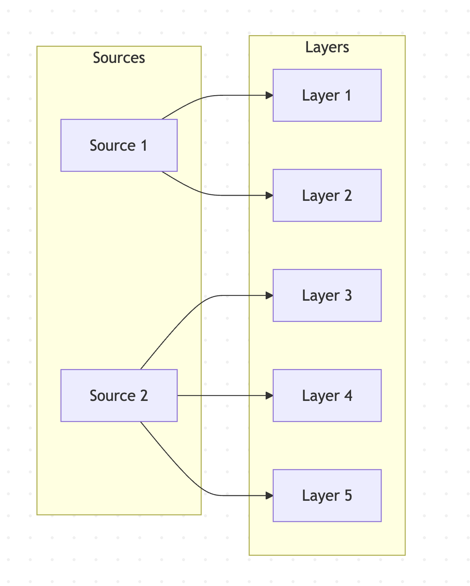

<script src="https://g69ye6vo2a.execute-api.ap-northeast-1.amazonaws.com/v1/client/vote-client.min.js"></script>
<script>
  document.addEventListener("DOMContentLoaded", () => {
    document.querySelectorAll("section").forEach(section => {
      const reaction = document.createElement("reaction-component");
      reaction.setAttribute("emojis", "👍,👎,🤔,💡");
      section.appendChild(reaction);
    });
  });
</script>
<style>
/* ページ番号は右上。リアクションコンポーネントをおきたいので */
section.title::after { top: 21px; }
</style>

<!-- _class: title -->

# MapLibre GL JS と OpenStreetMap で始める<br />ウェブカートグラフィ入門

## 第10回：スタイルの基本（ポイント、ライン、ポリゴン）

立命館大学 2025年度 秋セメスター 火曜5限
授業時間：95分

---

## 前回の振り返り

### 第9回の主要ポイント
- 地図のカスタマイズ（GeoJSON を地物として追加する）
- JSON形式でのスタイル定義

---

## style.json を利用した Maplibre GL JS のスタイリング

前回の授業では style オブジェクト (= JSON 形式互換)を変更することで地図の見た目をカスタマイズできた。
Maplibre GL JS の静的なスタイルは、この記法で全てが定義できる。

仕様: Maplibre Style Spec
https://maplibre.org/maplibre-style-spec/

---

以下のサンプルを使い、解説していく:
https://github.com/kamataryo/rits-2025-fall-cartography__10-webmap-style-sample

---

## Source と Layer

<div style="display: flex; align-items:center;">
<ul>
<li>Source => データソース
<li>Layer => 地図レイヤ
</ul>

</div>

---

## Source の種類 (`type`)

- `raster` ラスタタイル
- `geojson` GeoJSON
- `vector` ベクトルタイル
- etc.

---

## Source に必要なプロパティ

`"sources"` として **オブジェクト型** で指定

```json
{
  "sources": {
    "<source 1 ID>": {
      "type": "raster",
      "tiles": [
        "https://cyberjapandata.gsi.go.jp/xyz/std/{z}/{x}/{y}.png"
      ]
    },
    "<source 2 ID>": {
      "type": "geojson",
      "data": "https://example.com/sample.geojson"
    },
    ...
  }
}
```

---

## Layer

レイヤーは、上にあるものほど下にレンダリングされる（重なる）

- Source なしで使える type
  - `background`
- ラスタタイル Source で利用可能な type
  - `raster`
  - etc.
- ベクトルタイル/GeoJSON Source で利用可能な type
  - `circle`
  - `symbol`
  - `line`
  - `fill`
  - etc.

---

## Layer のプロパティの例

```javascript
// Circle レイヤ
{
  id: 'circle-layer', // 重複しないID
  type: 'circle',
  source: 'geojson-sample-source-2',
  filter: ['==', '$type', 'Point'], // $type はソースのジオメトリタイプを指定する
  layout: {
    'visibility': 'visible' // レイヤの表示・非表示
  },
  paint: {
    "circle-radius"         : 8,           // 半径（ピクセル）
    "circle-color"          : "#ff0000", // 塗りつぶし色
    "circle-opacity"        : 1.0,         // 塗りつぶし透明度
    "circle-stroke-color"   : "#ffffff", // 境界線色
    "circle-stroke-width"   : 2,           // 境界線幅
    "circle-stroke-opacity" : 1.0          // 境界線透明度
  },
}
```

---

## Filter

```js
filter: ['==', '$type', 'Point'], // $type はソースのジオメトリタイプを指定する

// Expression が利用可能（後述）
filter:['==', ['get', 'amenity'], 'university'],
```

---

## Expression

- ポーランド記法
  - `a + b`     => `+ a b`
  - `a + b * c` => `+ a (* b c)`
  - `T & F`     => `& T F`

- Maplibre Style Spec は**ポーランド記法**的な定義を採用している
- JSON フォーマットによって複雑な地図スタイルを静的かつ柔軟に定義することが可能

## Expression の例

```Javascript
['get', '<プロパティ名>'] // プロパティを取得する
['concat', '文字列A', '文字列B'] // 文字列を結合
['+', 100, 200] // 数字を加算
['to-string', ['get', '<数字型プロパティ名>']] // 数字を取得して、文字列に変換
```

## 値の内挿、ズームによる制御

https://docs.mapbox.com/style-spec/reference/expressions/#interpolate

---

## 課題

- 国土数値情報等から興味のあるデータを最低2つ、GeoJSON としてダウンロード
- どのようなプロパティがあるのかを確認
- リポジトリに配置して、source として読み込む
- レイヤーを作成する。この際、1つのソースに対して、2つ以上のレイヤーを作成してください（合計4つ）
- また、レイヤーのうち、少なくとも1つは、symbol レイヤーとしてください
- スタイルを設定する。Filter 及び Expression をそれぞれ少なくとも1つ利用してください
例:
  - 特定の値だけを持った地物のみを Filter で抽出する
  - Expression を積極的に使ってください(数字の後に単位をつける、演算を行なって、指標を導出する（人口密度など）)

---

## 次回予告

### 第10回：ベクトルタイルの活用
- ベクトルタイルの仕組みとフォーマット

---

<!-- _class: title -->

# ありがとうございました

## 次回もよろしくお願いします
