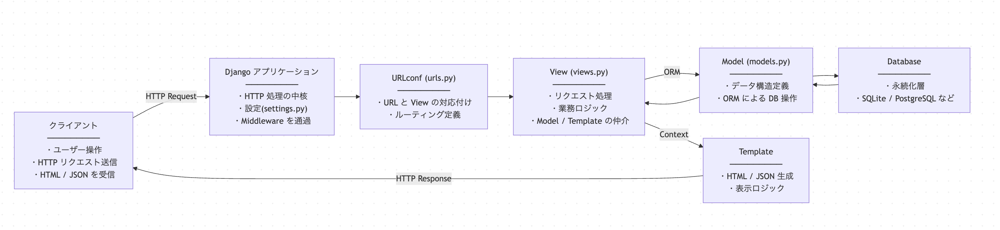

<script src="https://g69ye6vo2a.execute-api.ap-northeast-1.amazonaws.com/v1/client/vote-client.min.js"></script>
<script>
  document.addEventListener("DOMContentLoaded", () => {
    document.querySelectorAll("section").forEach(section => {
      const reaction = document.createElement("reaction-component");
      reaction.setAttribute("emojis", "👍,👎,🤔,💡");
      section.appendChild(reaction);
    });
  });
</script>
<style>
/* ページ番号は右上。リアクションコンポーネントをおきたいので */
section.title::after { top: 21px; }
</style>

<!-- _class: title -->

# MapLibre GL JS と OpenStreetMap で始める<br />ウェブカートグラフィ入門

## 第12回: フロントエンドフレームワーク入門

立命館大学 2025年度 秋セメスター 火曜5限
授業時間:95分

---

## 本日のアジェンダ

1. フレームワークとは
2. フロントエンドフレームワーク/バックエンドフレームワーク
3. フレームワークの例: React
4. 仮想 DOM と抽象化
5. React Maplibre での抽象化

---

## フレームワークとは

- プログラミングの方法は自由だが、時に過ぎる
- そこでフレームワークは、制約によってよくある実装パターンをあらかじめ決めておく
- それにより、実装に一貫性が生まれ、パフォーマンスやメンテナンス性を設計しやすくする

=> 自由をなくす代わりに、迷いを減らすためのミドルウェア
=> 基礎設計的な判断を“コードを書く前に”済ませておく仕組み

---

## バックエンド/フルスタックのフレームワーク

- データベース接続/サーバーロジック（認証・認可・制御など）/インターフェース構築などをまとめて提供
  - Ruby on Rails (Ruby)
  - Laravel (PHP)
  - Django (Python)
  - Spring Boot (Java)

---

## Django の例

1. https://github.com/new で新しいリポジトリを作成 `sandbox-django`などの名前をつける
2. [Create Codespace] ボタンで Codespace を起動
3. ターミナルで以下を実行

```shell
$ pip install django
$ django-admin startproject mysite
$ cd mysite
$ python manage.py migrate # データベースのマイグレーション
$ python manage.py createsuperuser # スーパーユーザー作成。適当なパスワードを設定する（すぐ消すので、脆弱で構いません。）
$ python manage.py runserver # アプリケーション起動
```

4. <開いた URL>/admin に遷移する

---

## この操作で構築できたシステム構成



---

## フロントエンドのフレームワーク

ブラウザ上に ユーザーインターフェース(UI)を構築することに特化したものが多い。

- DOM 操作を簡単にする
  - jQuery
- UI の見た目（スタイルシート）を提供
  - Bootstrap
- UI の構築とデータの状態管理を提供
  - React
  - Vue.js

---

## フロントエンドのフレームワークが提供するもの

- 便利で統一されたプログラミングのインターフェースを提供する
- 色々なブラウザの差を吸収し、一定の互換性を保つ
  （Chromium vs. Firefox vs. Safari）

---

## jQuery の例

```html
<button id="button">クリック</button>
<p id="message">Hello</p>

<script src="https://code.jquery.com/jquery-3.7.1.min.js"></script>
```

> ボタンクリックで、メッセージを書き換えたい

```javascript
$('#button').on('click', function () {
  $('#message').text('Clicked!');
});
```

---

## jQuery 無しで書いた場合

```javascript
const button = document.getElementById('button');
const message = document.getElementById('message');

button.addEventListener('click', function() {
  message.textContent = 'Clicked!'
});
```

---

## IE 6-8 時代

```javascript
var button = document.getElementById('button');
var message = document.getElementById('message');

if (button.addEventListener) {
  // モダンブラウザ（当時の Firefox / Chrome）
  button.addEventListener('click', function () {
    message.innerHTML = 'Clicked!';
  });
} else if (button.attachEvent) {
  // IE6〜8
  button.attachEvent('onclick', function () {
    message.innerHTML = 'Clicked!';
  });
}
```

---

# React　の例

```javascript
function App() {
  // メッセージの内容を管理
  const [message, setMessage] = useState('Hello');

　// ボタンを押した時の挙動を定義
  const handleClick = () => {
    setMessage('Clicked!')
  }

  // DOM を描画
  // JSX と呼ばれる html に似た拡張構文がよく使われている
  return <>
    <button onClick={handleClick}>クリック</button>
    <p>{message}</p>
  </>
}
```

[動くサンプル](https://reactplayground.vercel.app/#N4IgLgziBcBmCGAbCBTANCAbrK1QEsA7AExQA8A6AK1xHwFsAHAewCcwACAQUcY9lbN6HAOQUA9D0bUIZEQB1CDFuw4AlFPADGnAUNGtNOhUqZtOwDlsPwwKNc2acAvv0HCRNnQFpiQ8VqI+CiEYCaKWsyEEJyRofBEKKwcALwcfloArvQhYBQA5ihgAKKIKDmhAEIAngCSxAAUno5hAJQRUTEcgk6pVjZ2Dk4NcWAJhEnthD15hiRJDYoc6kZ51pp2peW5i4TLyxraeQDKYKz4OgCyzKRoS-uEmYiId3v7hzoU67YoWxVgDSkU2WU1aIAwUhkZBgdDMqg+YDQHEsmVQGlgSNRKFOPw4rj0Hi8YUUilgmUIOnwUW4vAarWR93E4g4gEOGQDDDIBuhkAPwyADoZAHYMgFDFQCd2oAkhkAhd6AMBd7nEugBtHIQCDwQpI1BgS4oRXKlAAXT6WJxdiaAAkUM9mCJWgBuRnMwDVDIAyhkAzwyAfoYudLOpxZZFyYiOGqAMLMX16tIGsZGgAMU0UgAAGJkcQA7DC6nSLAD1GgHUGQD6DIAhMz5gExjQCrSiLAFnagEr-D3RTgAC3gJDKAaCWgA1n06akAHwMt7LNUarWFJqNi7NlDEACElvuvaKQd9I2DoU7VkXnAA1BwAIzAvEkwi2jgAEQA8pcOCLAPPGgG5XA8AKWOAA0OIALBkAPiqABwZADEMgGiGDjVsD0IgHCANYMgA88lmgCHRoArPqANOWgDhpoAMgyABEMgDyDIA-vKAPEMn6AGYMgAiDN+9yGGAmSsHsAA8HbThwZEAEaZGAYDUlEw4tikwC1vWKAsc2zgdoA9QyAFcMbJ8WR4h0QxUSUT21GMB2wAKkqhTOKJsn3KJUnOHu5AqJwpAIE8nBSOCIAxNUZRfIqMIUDRYB7MA9ywFEYDeBA+AAF4oNAHAAEyGPQNqEM4IDOM4QA)

---

## DOM と抽象化

- React は複雑なユーザーインターフェースを部品（コンポーネント）として組み立てるためのフレームワーク
- 「今表示したい内容」を書くだけで画面の更新は React が面倒を見る
- データが変わるとそれに合わせて画面が自動で更新される
- 開発者は DOM を直接操作しない

---

## React Maplibre での抽象化

- MapLibre GL JS には、React 向けのラッパーライブラリが用意されている
- 地図を React コンポーネントとして扱える
- レイヤやマーカーを、DOM 操作ではなく宣言的に記述できる

---

## Maplibre GL JS で、クリックした位置にマーカーを置く

### JavaScript のみ

```javascript
const map = new maplibregl.Map({
  container: "map",
  style: "https://demotiles.maplibre.org/style.json",
  center: [139.7, 35.6], zoom: 12,
});

let marker = null;

map.on("click", (e) => {
  const { lng, lat } = e.lngLat;

  // 既存マーカーを削除
  if (marker) {
    marker.remove();
  }
  // 新しいマーカーを作成
  marker = new maplibregl.Marker()
    .setLngLat([lng, lat])
    .addTo(map);
});
```

---

### React Maplibre を使う

```jsx
export default function App() {
  const [marker, setMarker] = useState(null);
  const onMapClick = (e) => {
    setMarker(e.lngLat)
  }

  return (
    <Map
      style={{ height: 400 }}
      initialViewState={{ longitude: 139.7, latitude: 35.6, zoom: 12 }}
      mapStyle="https://demotiles.maplibre.org/style.json"
      onClick={onMapClick}
    >
      {marker && (
        <Marker longitude={marker.lng} latitude={marker.lat} />
      )}
    </Map>
  );
}
```

---

### その他のサンプル（sources/layers）

```javascript
<Map>
  <Source id="roads" type="vector" url="https://tiles.example.com">
    <Layer id="road-line" type="line" paint={{ 'line-color': 'red' }} />
  </Source>
</Map>
```

---

### 命令的 vs 宣言的

- MapLibre GL JS（命令的）
「クリックされたら、マーカーを消して、作って、追加せよ」

- React Maplibre（宣言的）
「マーカーの位置はこの state（データ管理用の入れ物） である」

---

### React Maplibre のポイント

- Map/Marker/Source/Layer etc. を HTML/DOM のように記述しているが、その実態はオブジェクト。HTML ではない
- 地図の世界を抽象化することで、DOM と似たインターフェースで扱うことを可能にしている
- そして、データの状態の変化に応じて、MapLibre のオブジェクトを自動的に更新する

---

## 本日のまとめ

- フレームワークは単に「楽をする道具」ではなく  
  **よくある判断をあらかじめ固定するための仕組み**
- 特に React などのライブラリが提供する機能:
  - 抽象化により、
    - *どう更新するか* ではなく  
    - **いま何を表示したいか** を書けるようになる
  - React は DOM を直接操作せず、**状態（state）→ UI** の対応関係を管理する
  - React Maplibre は、 地図（MapLibre のオブジェクト）を **宣言的な UI コンポーネントとして扱えるようにする**

⭐︎ フレームワークを使うとは **「書き方」を覚えることではなく、「考える必要がある範囲」を狭める**こと

---

## 自由課題(提出不要)

1. [React Playground](https://reactplayground.vercel.app/#N4IgLgziBcBmCGAbCBTANCAbrK1QEsA7AExQA8A6AK1xHwFsAHAewCcwACAQUcY9lbN6HAOQUA9D0bUIZEQB1CDFuw4AlFPADGnAUNGtNOhUqZtOwDlsPwwKNc2acAvv0HCRNnQFpiQ8VqI+CiEYCaKWsyEEJyRofBEKKwcALwcfloArvQhYBQA5ihgAKKIKDmhAEIAngCSxAAUno5hAJQRUTEcgk6pVjZ2Dk4NcWAJhEnthD15hiRJDYoc6kZ51pp2peW5i4TLyxraeQDKYKz4OgCyzKRoS-uEmYiId3v7hzoU67YoWxVgDSkU2WU1aIAwUhkZBgdDMqg+YDQHEsmVQGlgSNRKFOPw4rj0Hi8YUUilgmUIOnwUW4vAarWR93E4g4gEOGQDDDIBuhkAPwyADoZAHYMgFDFQCd2oAkhkAhd6AMBd7nEugBtHIQCDwQpI1BgS4oRXKlAAXT6WJxdiaAAkUM9mCJWgBuRnMwDVDIAyhkAzwyAfoYudLOpxZZFyYiOGqAMLMX16tIGsZGgAMU0UgAAGJkcQA7DC6nSLAD1GgHUGQD6DIAhMz5gExjQCrSiLAFnagEr-D3RTgAC3gJDKAaCWgA1n06akAHwMt7LNUarWFJqNi7NlDEACElvuvaKQd9I2DoU7VkXnAA1BwAIzAvEkwi2jgAEQA8pcOCLAPPGgG5XA8AKWOAA0OIALBkAPiqABwZADEMgGiGDjVsD0IgHCANYMgA88lmgCHRoArPqANOWgDhpoAMgyABEMgDyDIA-vKAPEMn6AGYMgAiDN+9yGGAmSsHsAA8HbThwZEAEaZGAYDUlEw4tikwC1vWKAsc2zgdoA9QyAFcMbJ8WR4h0QxUSUT21GMB2wAKkqhTOKJsn3KJUnOHu5AqJwpAIE8nBSOCIAxNUZRfIqMIUDRYB7MA9ywFEYDeBA+AAF4oNAHAAEyGPQNqEM4IDOM4QA) にアクセス
2. `<p>{message}</p>` の下部に、`count` の数字を表示してみる。例: `<p>カウント: {count}</p>`
3. ボタンをクリックしたら、数字が2倍になって増えていくようにコードを書き換えてみる
